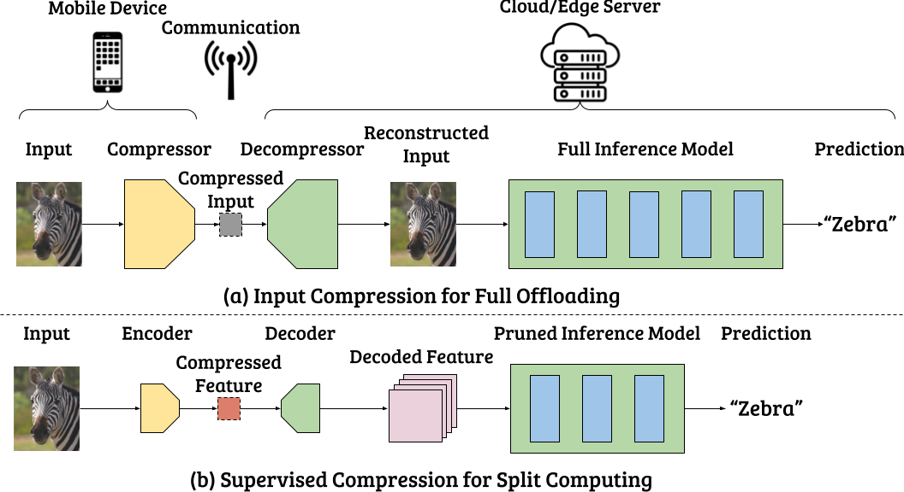
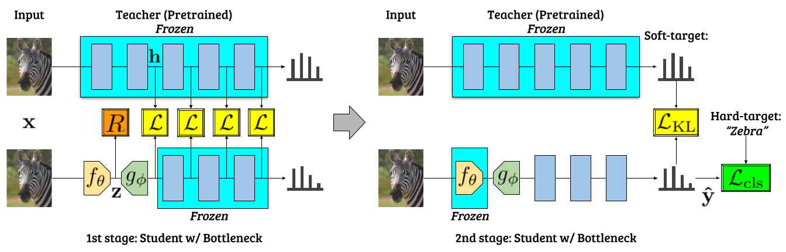

# Supervised Compression for Resource-constrained Edge Computing Systems

 
 

## Requirements
- Python >= 3.6.9
- pipenv

## Virtual environment setup
```
# For Python 3.6 users
pipenv install --python 3.6

# For Python 3.7 users
pipenv install --python 3.7

# For Python 3.8 users
pipenv install --python 3.8
```

## Citation
[[Preprint](https://arxiv.org/abs/2108.11898)]  
```bibtex
@article{matsubara2021supervised,
  title={Supervised Compression for Resource-constrained Edge Computing Systems},
  author={Matsubara, Yoshitomo and Yang, Ruihan and Levorato, Marco and Mandt, Stephan},
  journal={arXiv preprint arXiv:2108.11898},
  year={2021}
}
```

## 1. ImageNet (ILSVRC 2012): Image Classification
### 1.1 Download the datasets
As the terms of use do not allow to distribute the URLs, you will have to create an account [here](http://image-net.org/download) to get the URLs, and replace `${TRAIN_DATASET_URL}` and `${VAL_DATASET_URL}` with them.

```shell
wget ${TRAIN_DATASET_URL} ./
wget ${VAL_DATASET_URL} ./
```

### 1.2 Untar and extract files

```shell
# Go to the root of this repository
mkdir ~/dataset/ilsvrc2012/{train,val} -p
mv ILSVRC2012_img_train.tar ~/dataset/ilsvrc2012/train/
cd ~/dataset/ilsvrc2012/train/
tar -xvf ILSVRC2012_img_train.tar
mv ILSVRC2012_img_train.tar ../
for f in *.tar; do
  d=`basename $f .tar`
  mkdir $d
  (cd $d && tar xf ../$f)
done
rm -r *.tar

mv ILSVRC2012_img_val.tar ~/dataset/ilsvrc2012/val/
wget https://raw.githubusercontent.com/soumith/imagenetloader.torch/master/valprep.sh
mv valprep.sh ~/dataset/ilsvrc2012/val/
cd ~/dataset/ilsvrc2012/val/
tar -xvf ILSVRC2012_img_val.tar
mv ILSVRC2012_img_val.tar ../
sh valprep.sh
mv valprep.sh ../
```

### 1.3 Input compression (IC) baselines
#### JPEG codec
```shell
echo 'jpeg quality=100'
pipenv run python image_classification.py -test_only --config configs/ilsvrc2012/input_compression/jpeg-resnet50.yaml

for quality in $(seq 100 -10 20)
do
  next_quality=$((quality-10))
  echo 'jpeg quality=${next_quality}'
  sed -i "s/jpeg_quality: ${quality}/jpeg_quality: ${next_quality}/" configs/ilsvrc2012/input_compression/jpeg-resnet50.yaml
  pipenv run python image_classification.py -test_only --config configs/ilsvrc2012/input_compression/jpeg-resnet50.yaml
done
```

#### WebP codec
```shell
echo 'webp quality=100'
pipenv run python image_classification.py -test_only --config configs/ilsvrc2012/input_compression/webp-resnet50.yaml

for quality in $(seq 100 -10 20)
do
  next_quality=$((quality-10))
  echo 'webp quality=${next_quality}'
  sed -i "s/webp_quality: ${quality}/webp_quality: ${next_quality}/" configs/ilsvrc2012/input_compression/webp-resnet50.yaml
  pipenv run python image_classification.py -test_only --config configs/ilsvrc2012/input_compression/webp-resnet50.yaml
done
```

#### BPG codec
Install BPG following the instructions [here](https://bellard.org/bpg/).  
If you do not place **bpgenc** and **bpgdec** at '~/manually_installed/libbpg-0.9.8/', 
edit the `encoder_path` and `decoder_path` in `bpg-resnet.yaml` like [this](https://github.com/yoshitomo-matsubara/supervised-compression/blob/main/configs/ilsvrc2012/input_compression/bpg-resnet50.yaml#L19-L20).

```shell
echo 'bpg quality=50'
pipenv run python image_classification.py -test_only --config configs/ilsvrc2012/input_compression/bpg-resnet50.yaml

for quality in $(seq 50 -5 5)
do
  next_quality=$((quality-5))
  echo 'bpg quality=${next_quality}'
  sed -i "s/bpg_quality: ${quality}/bpg_quality: ${next_quality}/" configs/ilsvrc2012/input_compression/bpg-resnet50.yaml
  pipenv run python image_classification.py -test_only --config configs/ilsvrc2012/input_compression/bpg-resnet50.yaml
done
```

#### Factorized prior 
Make sure you have downloaded and unzipped the pretrained checkpoints for this model. The checkpoint files should be 
placed at `./resource/ckpt/input_compression/` ad specified in the yaml file.

```shell
echo 'beta=0.00015625'
pipenv run python image_classification.py -test_only --config configs/ilsvrc2012/input_compression/factorized_prior_ae_128ch-resnet50.yaml
prev_beta=0.00015625

for beta in 0.0003125 0.000625 0.00125 0.0025 0.005 0.01 0.02
do
  echo 'beta=${beta}'
  sed -i "s/beta_${prev_beta}/beta_${beta}/" configs/ilsvrc2012/input_compression/factorized_prior_ae_128ch-resnet50.yaml
  pipenv run python image_classification.py -test_only --config configs/ilsvrc2012/input_compression/factorized_prior_ae_128ch-resnet50.yaml
  prev_beta=${beta}
done
```


#### Mean-scale hyperprior 
Make sure you have downloaded and unzipped the pretrained checkpoints for this model. The checkpoint files should be 
placed at `./resource/ckpt/input_compression/` ad specified in the yaml file.

```shell
echo 'beta=0.00015625'
pipenv run python image_classification.py -test_only --config configs/ilsvrc2012/input_compression/hierarchical_prior_ae_128ch-resnet50.yaml
prev_beta=0.00015625

for beta in 0.0003125 0.000625 0.00125 0.0025 0.005 0.01 0.02
do
  echo 'beta=${beta}'
  sed -i "s/beta_${prev_beta}/beta_${beta}/" configs/ilsvrc2012/input_compression/hierarchical_prior_ae_128ch-resnet50.yaml
  pipenv run python image_classification.py -test_only --config configs/ilsvrc2012/input_compression/hierarchical_prior_ae_128ch-resnet50.yaml
  prev_beta=${beta}
done
```

### 1.4 Feature compression (FC) baselines
#### Channel reduction and bottleneck quantization
Yoshitomo Matsubara, Marco Levorato. ["Neural Compression and Filtering for Edge-assisted Real-time Object Detection in Challenged Networks"](https://github.com/yoshitomo-matsubara/hnd-ghnd-object-detectors)  

Make sure you have downloaded and unzipped the pretrained checkpoints for this model. The checkpoint files should be 
placed at `./resource/ckpt/ilsvrc2012/bq/` ad specified in the yaml file.

```shell
for bch in 12 9 6 3 2
do
  echo 'bottleneck channel=${bch}'
  pipenv run python image_classification.py -test_only --config configs/ilsvrc2012/bq/custom_resnet50-bq${bch}ch_from_resnet50.yaml
done
```

#### End-to-end training
Saurabh Singh, Sami Abu-El-Haija, Nick Johnston, Johannes Ballé, Abhinav Shrivastava, George Toderici. "End-to-End Learning of Compressible Features"  

Make sure you have downloaded and unzipped the pretrained checkpoints for this model. The checkpoint files should be 
placed at `./resource/ckpt/ilsvrc2012/singh_et_al/` ad specified in the yaml file.

```shell
for beta in 5.0e-11 1.0e-10 2.0e-10 4.0e-10 8.0e-10 1.6e-9 6.4e-9 1.28e-8
do
  echo 'beta=${beta}'
  pipenv run python image_classification.py -test_only --config configs/ilsvrc2012/singh_et_al/bottleneck_resnet50-b24ch_igdn-beta${beta}_from_resnet50.yaml
done
```

### 1.5 Our supervised compression
Make sure you have downloaded and unzipped the pretrained checkpoints for this model. The checkpoint files should be 
placed at `./resource/ckpt/ilsvrc2012/pre_ghnd-kd/` ad specified in the yaml file.

```shell
for beta in 0.01 0.02 0.04 0.08 0.16 0.32 0.64 1.28 2.56 
do
  echo 'beta=${beta}'
  pipenv run python image_classification.py -test_only --config configs/ilsvrc2012/pre_ghnd-kd/bottleneck_resnet50-b24ch_igdn-beta${beta}_from_resnet50.yaml
done
```
